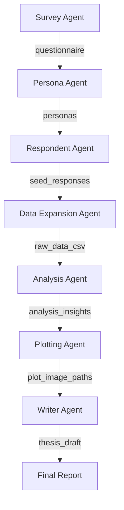

# PaperAnvil 多智能体调研科研工作流文档

本文档详细介绍了 PaperAnvil 系统的全流程工作流，涵盖了从问卷设计到论文撰写的各个阶段。

## 工作流概览

系统采用多智能体协作模式，通过 [SystemState](file:///d:/dataagent/PaperAnvil/src/workflow/state.py#5-155) 在各节点间传递数据。

---

## 核心节点说明

### 1. 问卷设计阶段 (Survey Agent)
- **职责**: 根据研究主题，自动生成结构化问卷。
- **产出**: `questionnaire.json` (包含人口学题、李克特量表题、开放题)。

### 2. 画像定义阶段 (Persona Agent)
- **职责**: 定义参与调研的用户画像及其比例分布。
- **产出**: `personas` 列表 (包含年龄、背景、回答倾向性等)。

### 3. 初始答题阶段 (Respondent Agent)
- **职责**: 驱动 LLM 模拟不同画像的真实答题行为，生成“种子数据”。
- **产出**: `seed_responses.json`。

### 4. 数据扩增阶段 (Data Expansion Agent)
- **职责**: 基于种子数据和正态分布逻辑，将样本量扩充至海量级别（如 5000 条）。
- **工具**: [src/tools/data_expansion.py](file:///d:/dataagent/PaperAnvil/src/tools/data_expansion.py)。
- **产出**: [data/raw_data/simulated_data.csv](file:///d:/dataagent/PaperAnvil/data/raw_data/simulated_data.csv)。

### 5. 深度分析阶段 (Analysis Agent)
该阶段集成两大工具类进行全方位数据挖掘。

#### 基础统计工具 (BasicStatsTool)
- **功能**: 计算频率分布、均值、标准差、百分比。
- **产出**: `data/intermediate/basic_stats.json`。

#### 机器学习分析工具 (StateTool)
- **聚类 (Clustering)**: 使用 K-Means 和 DBSCAN 发现用户分群。
- **异常检测 (Anomaly Detection)**: 使用孤立森林识别偏激样本。
- **相关性分析 (Correlation)**: 计算人口特征与评分间的关联。
- **特征贡献度 (Feature Importance)**: 评估影响满意度的核心驱动力。
- **产出**: `data/intermediate/analysis_results.json`。

### 6. 可视化绘图阶段 (Plotting Agent)
- **职责**: 读取分析结果，生成专业科研图表。
- **产出**: 存放在 `data/output/` 的一系列图片。

### 7. 论文撰写阶段 (Writer Agent)
- **职责**: 整合数据结论、图表和背景信息，撰写完整的 Markdown 格式论文草稿。
- **产出**: `thesis_draft.md`。

---

## 如何运行
1. 配置 `.env` 环境文件（API Key 等）。
2. 执行主程序（如 `main.py`）启动 LangGraph 工作流。
3. 在 `data/` 目录下查看各阶段产出的中间件与最终成果。
